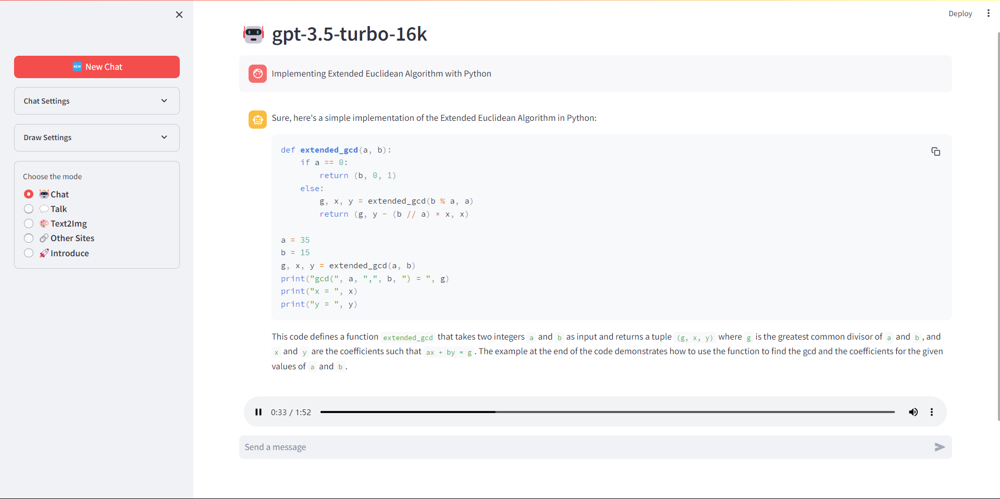
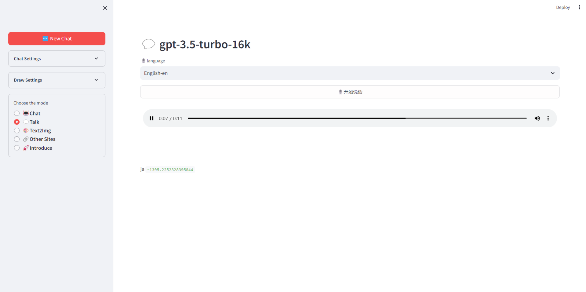
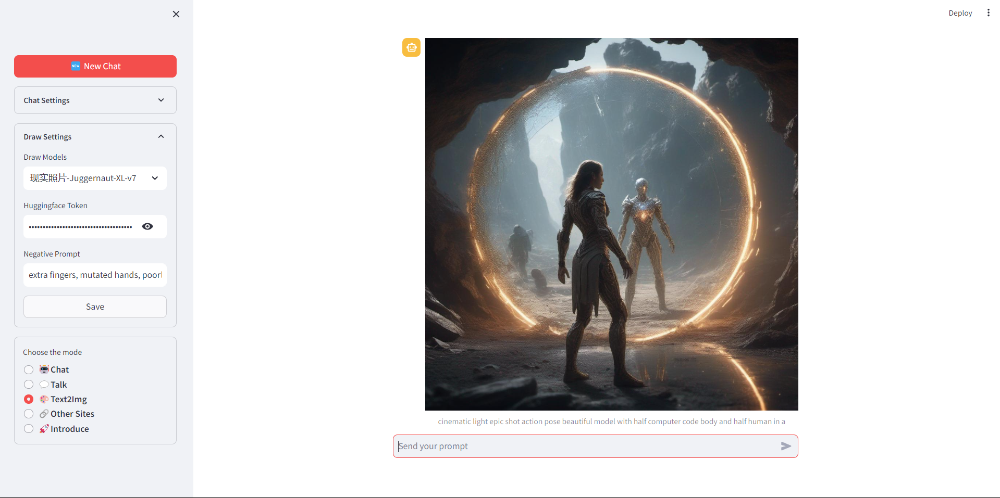

# Free GPT(gpt4free + streamlit)

> https://github.com/Komorebi-yaodong/FreeGPT.git
## notion
这个库的特点是提供了调用gpt4free可用接口的前端，但是缺点也很明显：我不太熟悉streamlit时写的代码，所以内容可能有点杂乱gpt4free稳定性不高。不妨使用免费的gpt_api_free项目中的API和gemini-pro的token以及hugging face的token来使用AI吧，我也写了一个前端，项目链接是https://github.com/Komorebi-yaodong/AiTool.git
---
The characteristic of this library is that it provides a front-end for calling the available interfaces of gpt4free, but the disadvantage is also obvious: I am not very familiar with the code written during streamlit, so the content may be a bit messy and gpt4free has low stability. Why not use the free GPT_ API_ Let's use AI with the API, Gemini Pro tokens, and Hugging Face tokens in the free project. I have also written a front-end, and the project link is https://github.com/komorebi-yaodong/aitool.git
---

## Getting Started

### local

```
pip install -r requirements.txt
streamlit run streamlit_app.py
```

### deploy on share.streamlit.io

1. Fork this project
2. Access `https://share.streamlit.io/`and `New app`
3. Waiting to use!

## Usage

### Chat function(🤖Chat||💬Talk)





1. Choose the model you want to chat with;
2. 🕵️‍♂️(Search Providers) could help you to find available provider(bold);
3. Providers list would be update by test result;
4. Chat with the model if provider is not void!

> rember to clice `save` button after changging settings or Searching Providers

## Img function(🎨**Text2Img**)



1. Register on [huggingface](https://huggingface.co/);
2. Generate Access Tokens in [Account Settings](https://huggingface.co/settings/account);
3. Fill the token into `Huggingface Token`;
4. Choose the model you want to use;
5. Draw what you want!

---

## About

> This project is non-profit, please do not use this project for profit purposes
>
> The data from other sites in this project is for reference only.
